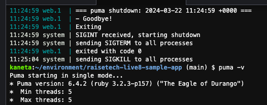
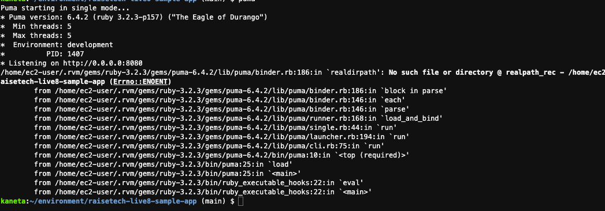

# 第3回課題

## 1. AP サーバーについて
### ＜AP サーバーの名前とバージョン＞  
- APサーバー名：Puma  
- Puma version: 6.4.2  

### ＜AP サーバーを終了させた場合、引き続きアクセスできるのか＞
- A.出来ない  
  

再起動  

### 

## 2. DB サーバーについて  
###  <DB サーバー>  
-  DB サーバー（DB エンジン)名:mysql
-  mysql : Ver 8.0.36  
  

### ＜DB サーバーを終了させた場合、引き続きアクセスできるのか＞  
A.出来ない  
  

### ＜Railsの構成管理ツール＞  
構成管理ツールはBundlerでした。
  
