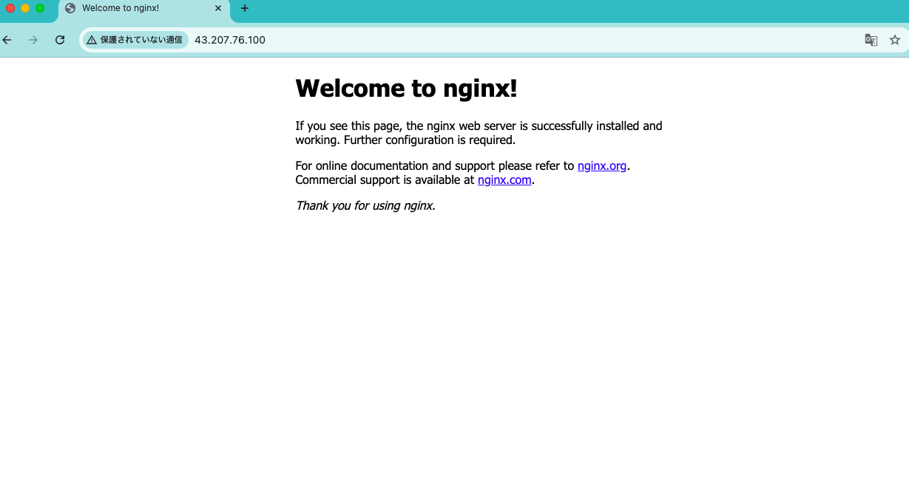

# 第5回課題
## 組み込みサーバーでのRailsアプリケーションの動作確認
  

## リッスン設定を Unix Socket に変更しcurlで動作確認
  

## Nginxの単体動作確認
  

## NginxとPumaでUnix socketを使った連携動作確認
  

## ALBを追加して動作確認

## S3を追加して動作確認

- オブジェクトが保存されていることの確認

## AWS構成図の作成
