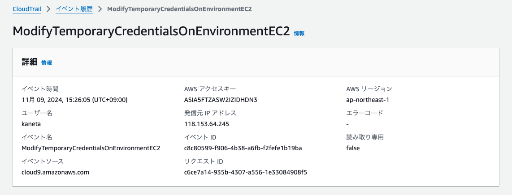
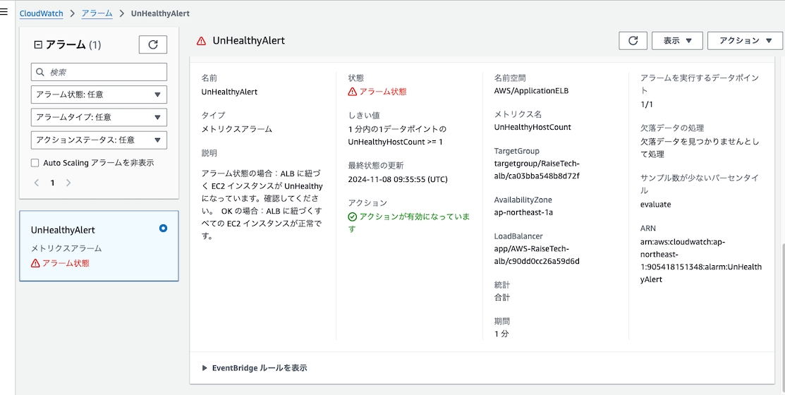
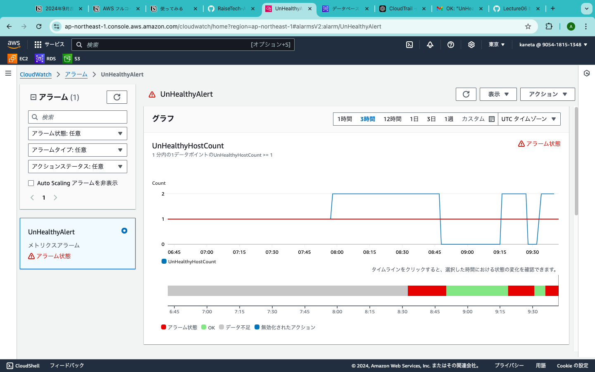
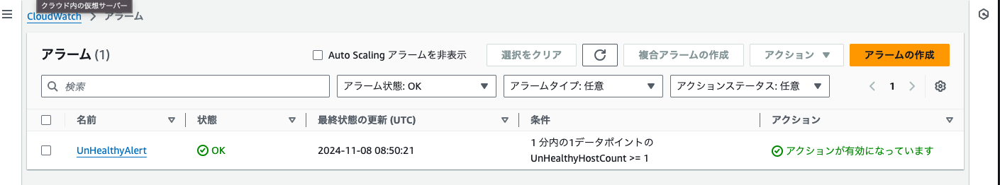
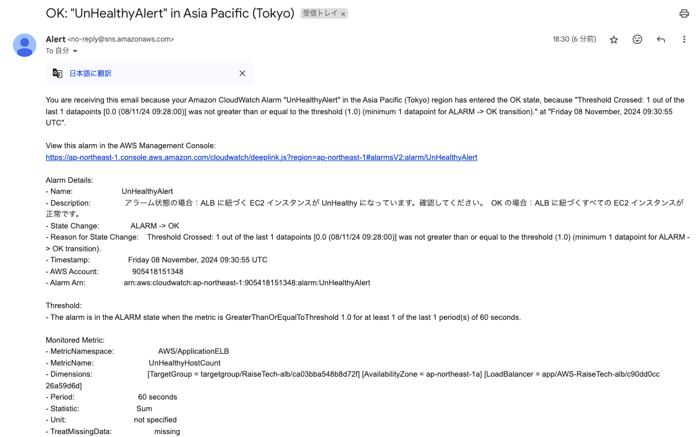
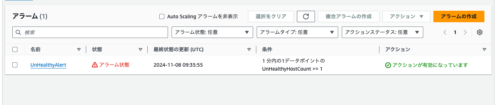
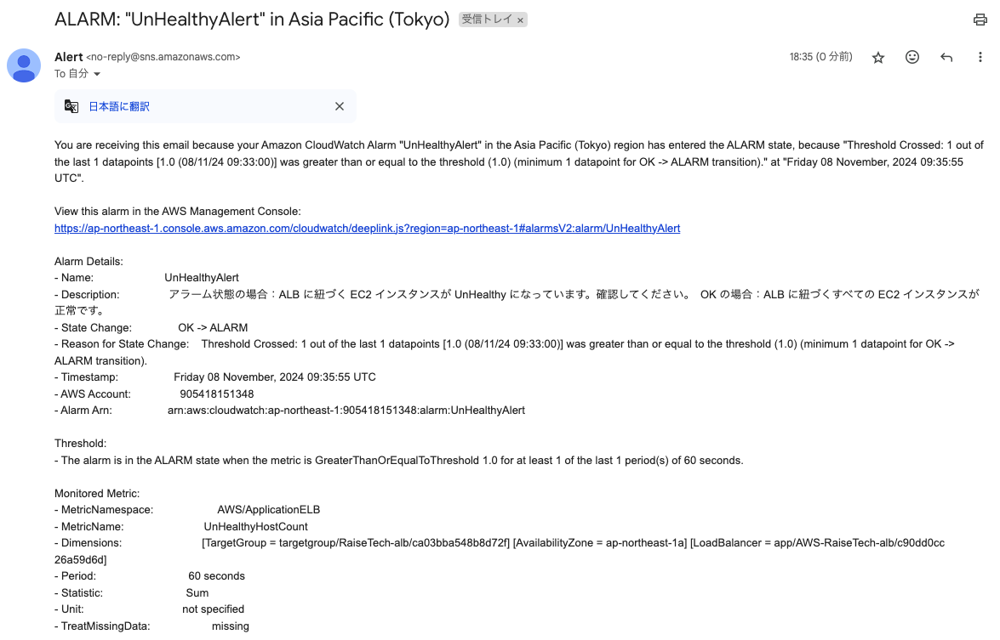
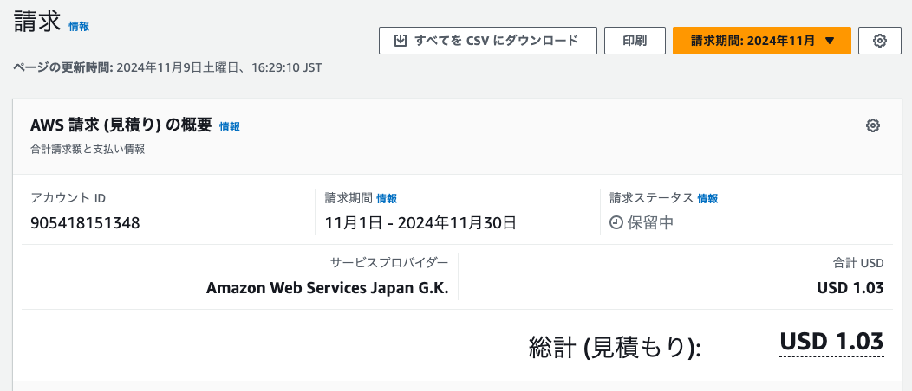
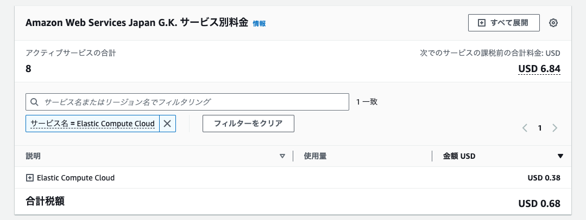

# 第6回課題
## CloudTrail イベント履歴
- #### イベント名　ModifyTemporaryCredentialsOnEnvironmentEC2 
- #### イベント内容に含まれる情報（３つ）  
イベント時間  
イベントソース  
ユーザー名  
 

## CloudWatch アラーム  
### アラームの詳細  
  
  

- ### Rails アプリケーションが使える状態  
アラームが OK 状態になり、OK メールが通知される。  
  
    
- ### Rails アプリケーションが使えない状態    
アラームがアラーム状態になり、ALARMメールが通知される。  
  
  

## AWS利用料金見積もり
- 今までに作成したリソースの見積もり  
URL:https://calculator.aws/#/estimate?id=423cb387b60adf3d08300558562f5773c450b81e

- 現在の利用料  
  
- 先月のEC2 の料金  
  
- 無料利用枠で収まっているか  
アカウント作成から12カ月経過しているため、無料利用枠の対象外だった。  
RDSやEC2をこまめに停止していたためコストはあまりかかっていなかった。  
しかし、前回課題で設定したALBが使用していなくてもVPC内にあるだけで毎月コストがかかってしまうということが判明した。今後課題で使用しないのならば削除した方がコスト削減につながると思った。